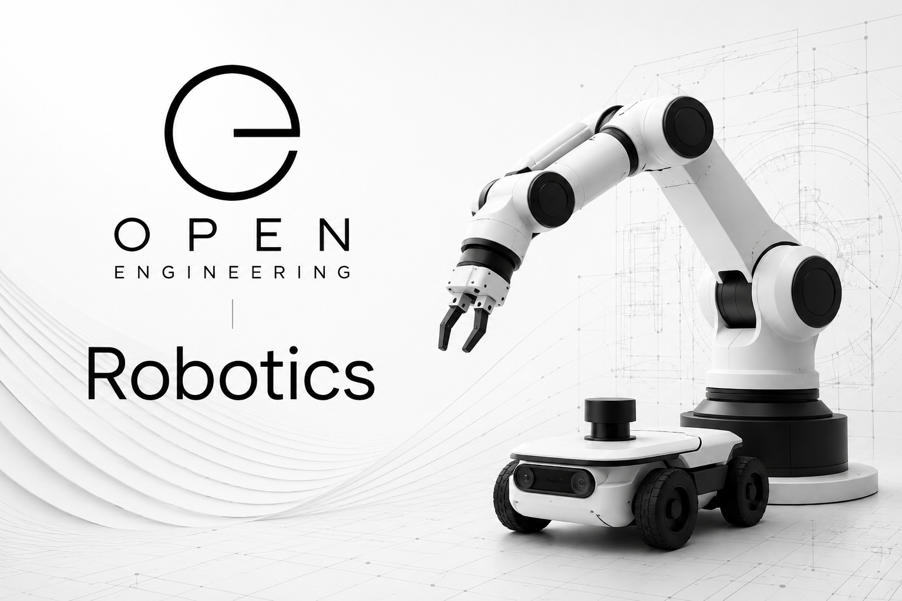

# Open Engineering Robotics



**Reusable robotics capabilities for engineering investigations, intelligent characters, performances, automation, and physical computing.**

Open Engineering Robotics provides the robotics foundation of the Open Engineering ecosystem.

Rather than building software for a single robot, platform, or manufacturer, this organization develops reusable robotics capabilities that can be composed into engineering systems, digital twins, AI agents, interactive performances, games, and intelligent devices.

Robotics becomes another reusable engineering discipline within Open Engineering.

---

# Mission

Build an open, vendor-neutral robotics platform that combines sensing, perception, planning, motion, simulation, and AI into composable engineering capabilities.

The goal is not to build one robot.

The goal is to make robotics reusable.

---

# Vision

Modern robotics spans many disciplines:

- mechanics
- electronics
- embedded software
- middleware
- artificial intelligence
- computer vision
- motion planning
- cloud computing
- digital twins
- simulation
- safety engineering

Open Engineering Robotics brings these disciplines together under a common engineering model so they can be reused across projects.

A lamp.

A drone.

A mobile robot.

A manufacturing line.

A digital character.

A research platform.

They all share many of the same engineering building blocks.

---

# What this organization provides

- Robotics architectures
- Robot Operating System (ROS 2) integration
- Motion control
- Kinematics
- Inverse kinematics
- Navigation
- Manipulation
- Computer vision
- Camera integration
- Sensor integration
- Raspberry Pi robotics
- Embedded robotics
- Dynamixel support
- MQTT robotics
- EMQX integration
- Digital twins
- Simulation
- Safety patterns
- Human-robot interaction
- Robotics documentation
- Robotics reference implementations

---

# Example architecture

```
                 Open Engineering

                       Stories
                           │
                           ▼
                     Characters
                           │
                           ▼
                      Robotics
                           │
      ┌────────────────────┼────────────────────┐
      │                    │                    │
 Motion             Perception          Intelligence
      │                    │                    │
      ├────────────┬───────┴────────────┬───────┤
      │            │                    │
 Controllers   Sensors             Cameras
      │            │                    │
      └────────────┴────────────────────┘
                           │
                           ▼
                    Robot Middleware
                     (ROS 2 / MQTT)
                           │
                           ▼
                 Physical Devices & Robots
```

---

# Repository structure

Typical repositories may include:

```
robotics/
├── ros2/
├── controllers/
├── navigation/
├── perception/
├── manipulation/
├── vision/
├── cameras/
├── sensors/
├── motors/
├── dynamixel/
├── simulation/
├── digital-twins/
├── mqtt/
├── emqx/
├── raspberry-pi/
├── hardware/
├── safety/
└── examples/
```

---

# Relationship with the Open Engineering ecosystem

Open Engineering Robotics composes with many other Open Engineering organizations.

| Organization | Relationship |
|--------------|--------------|
| Open Engineering Devices | Physical hardware platforms |
| Open Engineering Sensors | Sensor interfaces and data |
| Open Engineering Characters | Embodied intelligent characters |
| Open Engineering Agent Fabrics | AI orchestration |
| Open Engineering Flows | Robotics workflows |
| Open Engineering Execution Platforms | Runtime execution |
| Open Engineering Ontologies | Robotics knowledge models |
| Open Engineering Map | Discovery of robotics capabilities |
| Open Engineering Atomic Sync | Synchronization into the engineering knowledge graph |

Together these organizations provide an end-to-end robotics engineering ecosystem.

---

# Technologies

Open Engineering Robotics is intended to support technologies including:

- ROS 2
- Raspberry Pi
- Linux
- Docker
- Kubernetes
- Crossplane
- MQTT
- EMQX
- Python
- C++
- Rust
- OpenCV
- Gazebo
- Isaac Sim
- Dynamixel
- CAN bus
- Serial communication
- USB
- WebRTC

while remaining vendor neutral and composable.

---

# Design principles

- Open by design
- Vendor neutral
- Composable capabilities
- Hardware abstraction
- Cloud-native robotics
- AI-native engineering
- Event-driven communication
- Digital-first development
- Simulation before deployment
- Evidence-driven engineering

---

# Open Engineering

Open Engineering is an open platform for engineering investigations, intelligent characters, robotics, games, performances, AI assistants, reusable capabilities, and composable engineering systems.

Open Engineering Robotics provides the physical embodiment layer that allows software intelligence to perceive, move, interact with, and understand the real world.

---

## License

This organization embraces open collaboration and supports the broader Open Engineering ecosystem.
